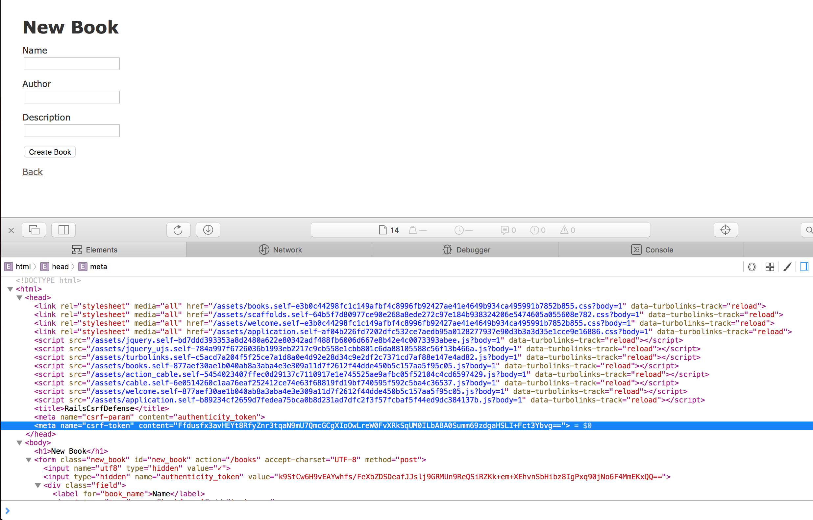

# Csrf Defense in Rails

This repo is to demo the CSRF defense in Rails.

## Setup Points

- [application.html.erb](app/views/layouts/application.html.erb#L5): the
  `csrf_meta_tags` would load CSRF token into the current web page:

  
  
  
## How Meta Tag is generated
  
[csrf_meta_tags](actionview/lib/action_view/helpers/csrf_helper.rb#13) would call 
[form_authenticity_token](actionpack/lib/action_controller/metal/request_forgery_protection.rb#284) to generate the 
corresponding token, here's the logic:

- in application.html.erb:

    ```erbruby
      <head>
        <title>RailsCsrfDefense</title>
        <%= csrf_meta_tags %>
        ... ...
      </head>
    ```
  
- in rails/actionview/lib/action_view/helpers/csrf_helper.rb:13

    ```ruby
    def csrf_meta_tags
      if protect_against_forgery?
        [
          tag('meta', :name => 'csrf-param', :content => request_forgery_protection_token),
          tag('meta', :name => 'csrf-token', :content => form_authenticity_token)
        ].join("\n").html_safe
      end
    end
    ```
    
- in rails/actionpack/lib/action_controller/metal/request_forgery_protection.rb:284

    ```ruby
      # Sets the token value for the current session.
      def form_authenticity_token(form_options: {})
        masked_authenticity_token(session, form_options: form_options)
      end

      # Creates a masked version of the authenticity token that varies
      # on each request. The masking is used to mitigate SSL attacks
      # like BREACH.
      def masked_authenticity_token(session, form_options: {})
        action, method = form_options.values_at(:action, :method)

        raw_token = if per_form_csrf_tokens && action && method
          action_path = normalize_action_path(action)
          per_form_csrf_token(session, action_path, method)
        else
          real_csrf_token(session)
        end

        one_time_pad = SecureRandom.random_bytes(AUTHENTICITY_TOKEN_LENGTH)
        encrypted_csrf_token = xor_byte_strings(one_time_pad, raw_token)
        masked_token = one_time_pad + encrypted_csrf_token
        Base64.strict_encode64(masked_token)
      end
    ```
    
where the `real_csrf_token` would generate token based on the current session:

- in rails/actionpack/lib/action_controller/metal/request_forgery_protection.rb:367

    ```ruby
      def real_csrf_token(session)
        session[:_csrf_token] ||= SecureRandom.base64(AUTHENTICITY_TOKEN_LENGTH)
        Base64.strict_decode64(session[:_csrf_token])
      end
    ```
