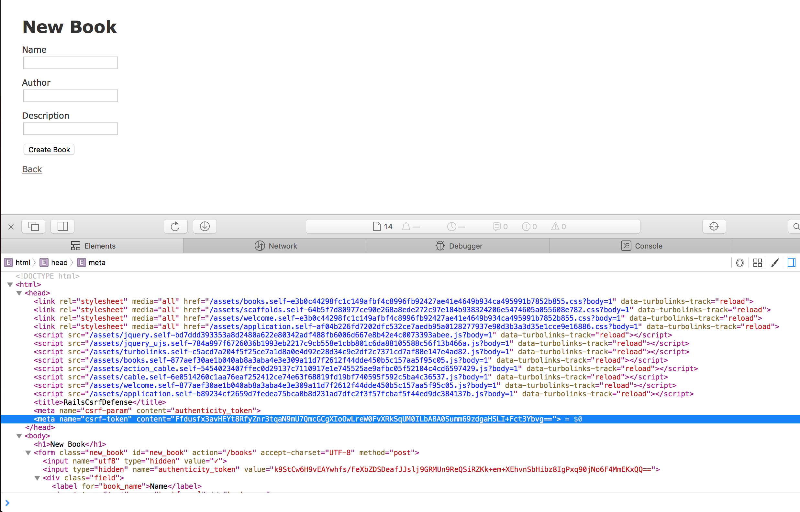

# Csrf Defense in Rails

This repo is to demo the CSRF defense in Rails.

## Include Token in Page

### Token in Meta Tag

#### Genreral View

- [application.html.erb](app/views/layouts/application.html.erb#L5): the
  `csrf_meta_tags` would load CSRF token into the current web page:

  
  
  
[csrf_meta_tags](actionview/lib/action_view/helpers/csrf_helper.rb#13) would call 
[form_authenticity_token](actionpack/lib/action_controller/metal/request_forgery_protection.rb#284) to generate the 
corresponding token, here's the logic:

- in application.html.erb:

    ```erbruby
      <head>
        <title>RailsCsrfDefense</title>
        <%= csrf_meta_tags %>
        ... ...
      </head>
    ```
  
#### Internal
- in rails/actionview/lib/action_view/helpers/csrf_helper.rb:13

    ```ruby
    def csrf_meta_tags
      if protect_against_forgery?
        [
          tag('meta', :name => 'csrf-param', :content => request_forgery_protection_token),
          tag('meta', :name => 'csrf-token', :content => form_authenticity_token)
        ].join("\n").html_safe
      end
    end
    ```
    
- in rails/actionpack/lib/action_controller/metal/request_forgery_protection.rb:284

    ```ruby
      # Sets the token value for the current session.
      def form_authenticity_token(form_options: {})
        masked_authenticity_token(session, form_options: form_options)
      end

      # Creates a masked version of the authenticity token that varies
      # on each request. The masking is used to mitigate SSL attacks
      # like BREACH.
      def masked_authenticity_token(session, form_options: {})
        action, method = form_options.values_at(:action, :method)

        raw_token = if per_form_csrf_tokens && action && method
          action_path = normalize_action_path(action)
          per_form_csrf_token(session, action_path, method)
        else
          real_csrf_token(session)
        end

        one_time_pad = SecureRandom.random_bytes(AUTHENTICITY_TOKEN_LENGTH)
        encrypted_csrf_token = xor_byte_strings(one_time_pad, raw_token)
        masked_token = one_time_pad + encrypted_csrf_token
        Base64.strict_encode64(masked_token)
      end
    ```
    
where the `real_csrf_token` would generate token randomly, and stored in the current session:

- in rails/actionpack/lib/action_controller/metal/request_forgery_protection.rb:367

    ```ruby
      def real_csrf_token(session)
        session[:_csrf_token] ||= SecureRandom.base64(AUTHENTICITY_TOKEN_LENGTH)
        Base64.strict_decode64(session[:_csrf_token])
      end
    ```
    
Because it is stored in the session, it doesn't change over time. This might leads to a "reply attack": sniff the
network traffic, get the token, reply the attack.

The `one_time_pad` is generated to mask the token, to overcome the [breach attack](https://www.youtube.com/watch?v=T4iTwNLPv4g),
which relies on some reflected content from the original request to guess the HTTPS secret.


### Token in the form

Further more, as we can see in the picture above, the `authenticity_token` is also included in each form, with the same
value as the one in the header.

#### General View

By default, the `form_for` method would use the same token as the one in meta-tag:

- in actionview/lib/action_view/helpers/form_helper.rb:428

    ```ruby
      def form_for(record, options = {}, &block)
        # ... ...
      
        html_options = options[:html] ||= {}

        # ... ...
      
        html_options[:authenticity_token] = options.delete(:authenticity_token)
      
        # ... ...
      
        form_tag_with_body(html_options, output)
      end
    ```

If you want to implement your own form-based CSRF protection, or you want this form to submit to an external URL, 
you can pass in a token which is generated by you:

```erbruby
<%= form_for @invoice, url: external_url, authenticity_token: 'external_token' do |f| %>
   ...
 <% end %>
```

you can also put `authenticity_token: false` if you don't want the token.

#### Internal

Internally, the `form_for` would call the `form_tag_with_body`, which would further call `form_tag_html`:

- in actionview/lib/action_view/helpers/form_tag_helper.rb:890

    ```ruby
        def form_tag_with_body(html_options, content)
          output = form_tag_html(html_options)
          output << content
          output.safe_concat("</form>")
        end
        
        def form_tag_html(html_options)
          extra_tags = extra_tags_for_form(html_options)
          tag(:form, html_options, true) + extra_tags
        end
    ```
    
The actual authenticity_token would be include in `extra_tags_for_form`:
    
- in actionview/lib/action_view/helpers/form_tag_helper.rb:856 

    ```ruby
        def extra_tags_for_form(html_options)
          authenticity_token = html_options.delete("authenticity_token")
          method = html_options.delete("method").to_s.downcase

          method_tag = case method
            when 'get'
              html_options["method"] = "get"
              ''
            when 'post', ''
              html_options["method"] = "post"
              token_tag(authenticity_token, form_options: {
                action: html_options["action"],
                method: "post"
              })
            else
              html_options["method"] = "post"
              method_tag(method) + token_tag(authenticity_token, form_options: {
                action: html_options["action"],
                method: method
              })
          end
        
          # ...
        end
      
    ```

As we can see, the actual authenticity_token would be include for any HTTP method other than `GET`. (i.e.: POST / PATCH / PUT / DELETE)

Last but not least, the actual token would be generated by `form_authenticity_token` in the `token_tag` method, which is
also used by the `csrf_meta_tags` method.

- in actionview/lib/action_view/helpers/url_helper.rb:589
  
    ```ruby
      def token_tag(token=nil, form_options: {})
        if token != false && protect_against_forgery?
          token ||= form_authenticity_token(form_options: form_options)
          tag(:input, type: "hidden", name: request_forgery_protection_token.to_s, value: token)
        else
          ''.freeze
        end
      end
    ```
